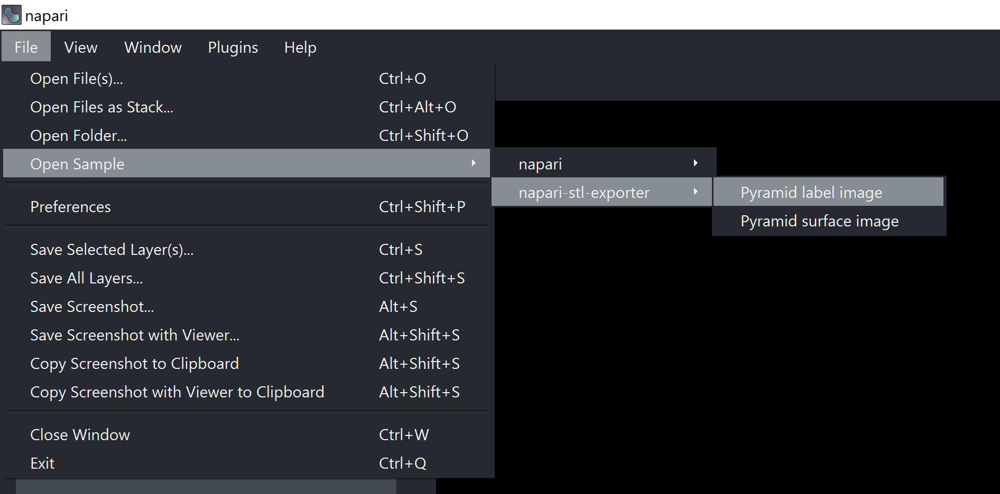

# napari-stl-exporter

[](https://github.com/jo-mueller/napari-stl-exporter/raw/master/LICENSE)
[](https://pypi.org/project/napari-stl-exporter)
[](https://python.org)
[](https://github.com/jo-mueller/napari-stl-exporter/actions)
[](https://codecov.io/gh/jo-mueller/napari-stl-exporter)

This plugin allows to convert data in Napari to 3D-printable [*.stl*, *.ply*] files using various algorithms. The generated files can then be read by common 3D-printing slicer programs (see below).


## Supported Napari layers:

Currently supported Napari layer types are:
* Label layers: The label data is converted to surface data using the [marching cubes algorithm](https://scikit-image.org/docs/dev/api/skimage.measure.html#skimage.measure.marching_cubes) implemented in [scikit-image](https://scikit-image.org/) and is then exported using [Vedo](https://vedo.embl.es/).
* Surface layers: Surface data can be natively exported with the [Vedo](https://vedo.embl.es/) library.
* Image layers: Image layers can be converted to a surface with the `image to surface` function.

### Supported file formats:
Currently supported file formats for export include:
* *.stl*: Common data format for 3D printing, can be read by common 3D slicer programs (see below)
* *.ply*: Common data storage format for surfaces, needs to be converted to *.stl* either with this plugin or with suitable software (e.g., Blender).

## Usage
This section explains which data can be written with the napari-stl-exported and how you can do so. 

**Label/Surface layers**

You can create sample label/surface data for export using the built-in functions as shown here:



To export the data, simply save the selected layer with `File > Save Selected Layer(s)` and specify the file ending to be `some_file.stl` or `some_file.ply`. This works for both [label layers](https://napari-docs-example.github.io/tutorials/fundamentals/labels.html) and [surface layers](https://napari-docs-example.github.io/tutorials/fundamentals/surface.html).

- Alternatively, you can add and export lbels layer data with this code snippet:
```python
import napari
import numpy as np

# Load and binarize image
label_image = np.zeros((100, 100, 100), dtype=int)
label_image[25:75, 25:75, 25:75] = 1

# Add data to viewer
viewer = napari.Viewer()
label_layer = viewer.add_labels(data, name='3D object')

# save the layer as 3D printable file to disc
napari.save_layers(r'/some/path/test.stl', [label_layer])
```

** Image data**

In order to convert image data to a surface, you can use the function `Plugins > napari-stl-exporter: Image to surface`, which will create this widget:


### 3D-printing
To actually send your object to a 3D-printer, it has to be further converted to the *.gcode* format with a Slicer program. The latter convert the 3D object to machine-relevant parameters (printing detail, motor trajectories, etc). Popular slicers are:

* [Slic3r](https://slic3r.org/): Documentation [here](https://manual.slic3r.org/intro/overview)
* [Prusa Slicer](https://www.prusa3d.com/prusaslicer/): Tutorial [here](https://help.prusa3d.com/en/article/first-print-with-prusaslicer_1753)

*Note*: You can also upload the STL file to [github.com](https://github.com) and interact with it in the browser:


----------------------------------

This [napari] plugin was generated with [Cookiecutter] using with [@napari]'s [cookiecutter-napari-plugin] template.

<!--
Don't miss the full getting started guide to set up your new package:
https://github.com/napari/cookiecutter-napari-plugin#getting-started

and review the napari docs for plugin developers:
https://napari.org/docs/plugins/index.html
-->

## Installation

You can install `napari-stl-exporter` via [pip]:

    pip install napari-stl-exporter

## Contributing

Contributions are very welcome. Tests can be run with [tox], please ensure
the coverage at least stays the same before you submit a pull request.

## License

Distributed under the terms of the [BSD-3] license,
"napari-stl-exporter" is free and open source software

## Issues

If you encounter any problems, please [file an issue] along with a detailed description or post to image.sc and tag ```El_Pollo_Diablo```

[napari]: https://github.com/napari/napari
[Cookiecutter]: https://github.com/audreyr/cookiecutter
[@napari]: https://github.com/napari
[MIT]: http://opensource.org/licenses/MIT
[BSD-3]: http://opensource.org/licenses/BSD-3-Clause
[GNU GPL v3.0]: http://www.gnu.org/licenses/gpl-3.0.txt
[GNU LGPL v3.0]: http://www.gnu.org/licenses/lgpl-3.0.txt
[Apache Software License 2.0]: http://www.apache.org/licenses/LICENSE-2.0
[Mozilla Public License 2.0]: https://www.mozilla.org/media/MPL/2.0/index.txt
[cookiecutter-napari-plugin]: https://github.com/napari/cookiecutter-napari-plugin

[napari]: https://github.com/napari/napari
[tox]: https://tox.readthedocs.io/en/latest/
[pip]: https://pypi.org/project/pip/
[PyPI]: https://pypi.org/
